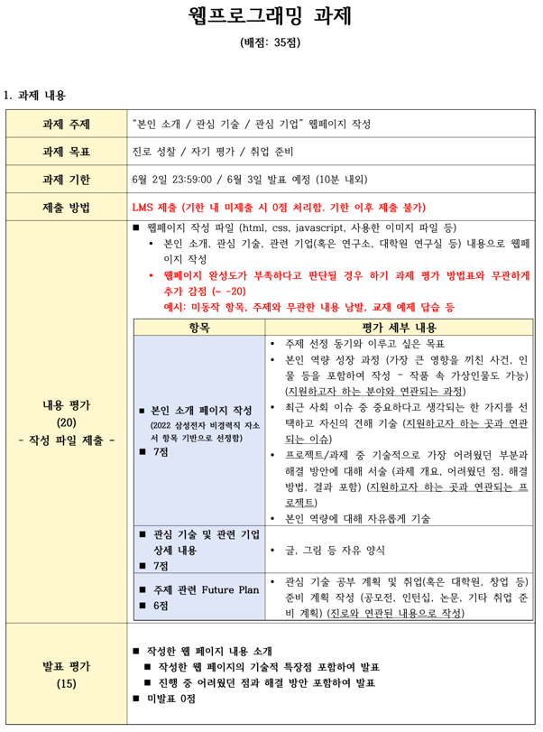

# Web_project

1 ..?
-> 멘토멘티, C언어 테트리스 프로젝트

2-1. 창의적공학설계, ONE PEN STORE
→ 교내 학부융합(이상용T), 2024 한국지식정보기술 학회

2-2. 자바2, PLAN-J
2024 창업동아리, 뜨개랑 (뜨개질 특화 플랫폼)
→ 2024 전국대학생 sw 창업 아이디어톤 참가, 2024 AI Sparks 창업 아이디어 공모전 참가 (장려), 2024 KNU 창업경진대회 참가 (우수상)

킥보드 사고 처리 시스템
→ 제 4회 미래와소프트웨어 아이디어 공모전, 2024 sw중심대학 우수작품 경진대회 (→ 2024 sw 인재 페스티벌)

3학년은 이후에 추가
(IRIS 프로젝트, 창업동아리 도담도담, 전공심화스터디, 역량그룹스터디, 구름톤 공주대 4기)

* C언어 JAVA 멘토&멘티, SQLD 자격증 취득